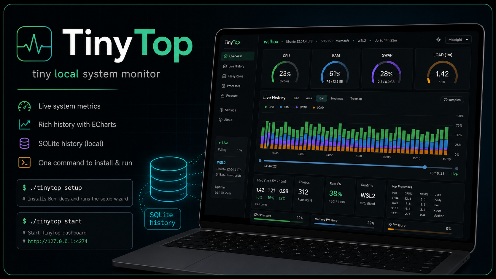

# TinyTop



A standalone local dashboard for live WSL/Linux workstation status. The default persistent runtime is a single Rust daemon that serves the dashboard, collects host telemetry, stores recent history in SQLite, and renders a dense browser UI with Apache ECharts.

## Current Status

- Version: `0.1.27`
- Runtime: Rust collector/dashboard daemon for persistent installs; Bun remains available for development and fallback
- Dashboard UI: `http://127.0.0.1:4274`
- Legacy collector API: `http://127.0.0.1:4276`
- Default SQLite database: `~/.local/share/tinytop/history.sqlite`
- SQLite retention: Rust daemon prunes raw samples by the saved retention window and keeps one-minute rollups by the saved rollup window
- History API: raw snapshots remain available through `/api/history`; rollup-backed chart points and timeline markers are available through `/api/history/points` and `/api/history/markers`
- Runtime identity: `./tinytop status` and `GET /api/version`
- Settings: browser-local display preferences plus SQLite-backed daemon defaults at `GET`/`PUT /api/settings`
- Network exposure: loopback only by default

## Install And Run

```bash
git clone <repo-url> tinytop
cd tinytop
./tinytop rust install-binary
./tinytop systemd install --rust
./tinytop systemd start
```

Open <http://127.0.0.1:4274>.

For persistent installs without Bun, use the Rust collector/dashboard daemon:

```bash
./tinytop rust install-binary
./tinytop systemd install --rust
./tinytop systemd start
```

If a release binary is not available for your platform, compile locally:

```bash
./tinytop install-rust --print-only
./tinytop rust build
./tinytop systemd install --rust
```

`./tinytop setup` is the Telecode-style Bun wizard for source/development installs. It asks whether to install the Rust collector/dashboard daemon or the legacy Bun collector path. For Rust installs, it also asks whether to use a GitHub release binary or a local Cargo compile. Verification inside the wizard is runtime-specific: Rust selections do not run Bun tests, and legacy Bun selections do not run Rust tests.

For full setup and configuration, see [INSTALL.md](INSTALL.md). For day-to-day usage, see [GUIDE.md](GUIDE.md).

## New User Guide

1. Clone the repo and enter it:

   ```bash
   git clone <repo-url> tinytop
   cd tinytop
   ```

2. Inspect the command center:

   ```bash
   ./tinytop help
   ./tinytop doctor
   ```

3. Install the Rust collector binary. Prefer a release binary:

   ```bash
   ./tinytop rust install-binary
   ```

   Or compile locally:

   ```bash
   ./tinytop install-rust --print-only
   ./tinytop rust build
   ```

4. Install persistent user-space systemd service:

   ```bash
   ./tinytop systemd install --rust
   ./tinytop systemd start
   ```

5. Open the dashboard:

   ```text
   http://127.0.0.1:4274
   ```

6. Install Bun only if you want the Bun setup wizard or TypeScript development:

   ```bash
   ./tinytop install-bun --print-only
   ./tinytop install-bun --yes
   ```

7. Optional source setup wizard:

   ```bash
   ./tinytop setup
   ```

8. Optional foreground runtime. The command center auto-selects the Rust collector/dashboard daemon when available and falls back to legacy Bun only when Rust is unavailable:

   ```bash
   ./tinytop start
   ```

   Force the legacy Bun dashboard when needed:

   ```bash
   TINYTOP_RUNTIME=legacy ./tinytop start
   ```

9. Useful maintenance commands:

   ```bash
   ./tinytop status
   ./tinytop logs
   ./tinytop db stats
   ./tinytop db backup
   ./tinytop db check
   ```

## Command Center

The root `./tinytop` command is the supported operator entrypoint:

```bash
./tinytop help
./tinytop doctor
./tinytop rust install-binary
./tinytop rust build
./tinytop install-bun --print-only
./tinytop setup
./tinytop start
./tinytop systemd install --rust
./tinytop db stats
./tinytop db backup
```

For persistent background collection, install user-space systemd services:

```bash
./tinytop systemd install --rust
./tinytop systemd start
```

## What It Shows

- CPU utilization, CPU core count, and load averages
- RAM and swap usage
- Kernel, distro, uptime, and automatic WSL versus real Linux detection
- Filesystem capacity and inode pressure
- CPU, memory, and I/O pressure from `/proc/pressure/*` when available
- Top processes by CPU and memory
- Live CPU, RAM, swap, and load gauges with sparklines, status strips, and stat tiles
- Apache ECharts History views: line, stacked area, stacked bar, heatmap, and treemap
- Responsive Bar mode that keeps a minimum bar width and rolls the visible window left as new samples arrive
- SQLite-backed recent history so browser refreshes refill History instead of starting empty
- Timestamp-based timeline with Live, 15m, 1h, 6h, 24h, 7d, and 30d range presets
- Rollup-backed 6h/24h/7d/30d timeline browsing with daemon-start, settings-change, and coverage-gap markers
- Timeline rail with overview trace, selected datetime context, compact metric values, history coverage, DB budget status, and a return-to-now control
- Operator status strip with Healthy, Warning, Critical, and Stale states from saved thresholds plus a detail drawer explaining metric values, thresholds, age, trend, and recent changes
- Process search, sort, density controls, and process detail drawer with redacted copy-safe command text, parent PID/start time when available, RSS, and per-PID CPU/RAM trend
- Filesystem root card, system-mount toggle, and threshold-colored filesystem bars
- Visible collector/dashboard runtime and version metadata in the sidebar
- In-app confirmation dialogs for browser-local destructive actions, including clearing the session history buffer
- Browser-local display preferences for theme, graph mode, selected history range, visible series, process table controls, filesystem toggle, and last section
- Settings dialog with separate `This Browser` local preferences and `This Daemon` SQLite-backed defaults, including threshold presets, validation, reset/default actions, unsaved-change guard, effective settings readout, target DB budget, thresholds, and enabled dashboard sections
- Rust Linux/WSL daemon under `agent/` with shared snapshot types, crate-backed collection, SQLx SQLite history, a no-Bun systemd path, and feature-gated native macOS/Windows collector modules started behind opt-in build features

## Common Commands

```bash
./tinytop setup
./tinytop rust install-binary
./tinytop rust build
./tinytop rust serve
./tinytop systemd render
./tinytop start
./tinytop start:split
./tinytop db stats
bun run dev
bun run collector
bun test
bun run check:bun
bun run check:rust
bun run check
bun run rust:test
bun run rust:serve
bun build legacy/dashboard/app.js --target=browser --outdir=/tmp/tinytop-build-check
```

## Rust Collector/Dashboard Daemon

The Rust workspace lives under `agent/` and provides the default persistent runtime:

```bash
cargo test --manifest-path agent/Cargo.toml --workspace
cargo run --manifest-path agent/Cargo.toml -p tinytop-agent -- collect --json
cargo run --manifest-path agent/Cargo.toml -p tinytop-agent -- serve
```

The Rust daemon is the collector and dashboard in one process on `127.0.0.1:4274`. The older Bun dashboard/collector split is still available with `TINYTOP_RUNTIME=legacy ./tinytop start`, `./tinytop start:split`, and `./tinytop systemd install --bun`.

Use these checks to confirm which runtime is serving the dashboard:

```bash
./tinytop status
curl -fsS http://127.0.0.1:4274/api/version
```

Implementation notes:

- The Rust Linux collector uses `procfs` and `sysinfo`; it does not shell out to `df`, `ps`, or `uname`.
- The live collector keeps a reusable `sysinfo::System` so repeated samples avoid rebuilding all collector state from scratch.
- Linux is the default supported collector feature. Native macOS and Windows collectors are present as opt-in Rust feature-gated modules for identity, CPU, memory, load equivalent, disks, and processes; Linux remains the reference implementation until those hosts receive full live-machine verification.
- Local Rust builds require Rust `1.95.0` or newer because the pinned `sysinfo` release uses that MSRV.

## Documentation Map

| File | Purpose |
| --- | --- |
| [HANDOFF.md](HANDOFF.md) | Current restart point, daemon state, verification evidence, and next work |
| [INSTALL.md](INSTALL.md) | Prerequisites, setup, environment variables, running, upgrade, uninstall |
| [GUIDE.md](GUIDE.md) | User guide for the dashboard UI, graph modes, timeline, refresh behavior |
| [ARCHITECTURE.md](ARCHITECTURE.md) | Process model, data flow, modules, SQLite schema, safety boundaries |
| [CHANGELOG.md](CHANGELOG.md) | Versioned release notes |
| [PROGRESS.md](PROGRESS.md) | Completed milestones and next work |
| [docs/guides/API.md](docs/guides/API.md) | Public dashboard API and internal collector API |
| [docs/guides/OPERATIONS.md](docs/guides/OPERATIONS.md) | Runtime checks, SQLite inspection, backup/reset, troubleshooting |
| [docs/sqlite-history-architecture.md](docs/sqlite-history-architecture.md) | Persistence design and current SQLite implementation |
| [docs/reports/2026-06-24-rust-agent-dependency-vetting.md](docs/reports/2026-06-24-rust-agent-dependency-vetting.md) | Rust collector dependency and SQLx vetting |
| [docs/reports/2026-06-25-rust-daemon-dependency-vetting.md](docs/reports/2026-06-25-rust-daemon-dependency-vetting.md) | Rust daemon and vendored dashboard asset dependency vetting |
| [docs/reports/2026-06-25-webui-confirmation-dialog-verification.md](docs/reports/2026-06-25-webui-confirmation-dialog-verification.md) | Web UI confirmation-dialog policy and rendered verification |
| [docs/reports/2026-06-25-documentation-sweep.md](docs/reports/2026-06-25-documentation-sweep.md) | Documentation sweep for the embedded Rust collector/dashboard asset move |
| [docs/reports/2026-06-26-history-retention-docs.md](docs/reports/2026-06-26-history-retention-docs.md) | Documentation sweep clarifying current SQLite retention and UI history-window behavior |
| [docs/reports/2026-06-26-runtime-specific-verification.md](docs/reports/2026-06-26-runtime-specific-verification.md) | Verification split for Rust versus legacy Bun setup choices |
| [docs/reports/2026-06-26-dashboard-timeline-settings.md](docs/reports/2026-06-26-dashboard-timeline-settings.md) | Timestamp timeline implementation, settings implementation, and smoke test evidence |
| [docs/reports/2026-06-26-runtime-auto-detect-version.md](docs/reports/2026-06-26-runtime-auto-detect-version.md) | Runtime auto-detection and API/sidebar version identity |
| [docs/reports/2026-06-26-settings-dialog.md](docs/reports/2026-06-26-settings-dialog.md) | Settings dialog presentation change and focused UI verification |
| [docs/reports/2026-06-26-load-gauge.md](docs/reports/2026-06-26-load-gauge.md) | Load overview gauge implementation and verification |
| [docs/reports/2026-06-26-dashboard-operator-console.md](docs/reports/2026-06-26-dashboard-operator-console.md) | Operator console dashboard slice, retention enforcement, rollups, and verification |
| [docs/reports/2026-06-26-select-dropdown-contrast.md](docs/reports/2026-06-26-select-dropdown-contrast.md) | Native dropdown contrast fix and embedded dashboard verification |
| [docs/superpowers/plans/2026-06-26-dashboard-timeline-settings.md](docs/superpowers/plans/2026-06-26-dashboard-timeline-settings.md) | Plan for timeline repair, SQLite daemon settings, settings UI, retention, and rollups |
| [docs/superpowers/plans/2026-06-26-dashboard-operator-console.md](docs/superpowers/plans/2026-06-26-dashboard-operator-console.md) | Executed plan for operator status, Timeline V2, settings application, process/filesystem controls, and history backend follow-through |
| [docs/superpowers/specs/2026-06-24-tinytop-install-wizard-design.md](docs/superpowers/specs/2026-06-24-tinytop-install-wizard-design.md) | Install wizard and systemd command-center design record |
| [docs/adr/README.md](docs/adr/README.md) | Architecture decision records |

## License

TinyTop is licensed under the Apache License, Version 2.0. See [LICENSE](LICENSE) and [NOTICE](NOTICE).

## Configuration Summary

| Variable | Default | Meaning |
| --- | --- | --- |
| `HOST` | `127.0.0.1` | Dashboard bind host |
| `PORT` | `4274` | Dashboard port |
| `HISTORY_WRITER_HOST` | `127.0.0.1` | Legacy collector bind host; env name retained for compatibility |
| `HISTORY_WRITER_PORT` | `4276` | Legacy collector port; env name retained for compatibility |
| `HISTORY_WRITER_URL` | unset | Existing collector URL; when set, dashboard does not spawn a collector |
| `HISTORY_POLL_MS` | `1500` | Collector sampling interval |
| `TINYTOP_RUNTIME` | `auto` | Runtime selection for `./tinytop start`: `auto`, `rust`, `legacy`, or `bun` |
| `TINYTOP_HISTORY_DB` | `~/.local/share/tinytop/history.sqlite` | SQLite database path |
| `TINYTOP_DISABLE_WRITER_SPAWN` | unset | Set to `1` when starting the legacy Bun collector separately |
| `TINYTOP_PUBLIC_DIR` | unset | Optional development override for Rust dashboard assets; unset uses embedded assets |

## Ports

The project claims these loopback ports in `~/.config/fleet/ports/tinytop.toml`:

- `127.0.0.1:4274` - dashboard UI
- `127.0.0.1:4276` - legacy/internal collector API for split mode

## Persistence

Recent history is stored in SQLite by the Rust daemon in the default runtime. In legacy Bun split mode, the collector process owns SQLite and the dashboard process reads through the collector API.

In the Rust daemon, raw samples are pruned from `metric_samples` using `retentionHours` from `/api/settings`. One-minute rollup buckets are maintained in `metric_rollups_1m` and pruned using `rollupRetentionDays`. The dashboard settings also store `targetDatabaseBytes`, which is surfaced in history coverage and DB budget UI. Legacy Bun split mode keeps the older manual archive/reset behavior.

Daemon dashboard defaults are stored in SQLite in `app_settings` through `GET /api/settings` and `PUT /api/settings`. These include default theme, default graph mode, browser refresh interval, default history window, retention and rollup defaults, top process count, redaction default, warning/critical thresholds, and enabled sections. Active theme, graph mode, history range, visible series, process table preferences, filesystem system-mount toggle, and last section stay in this browser's `localStorage`.

The dashboard does not render the whole database. On page load it requests the browser-selected timestamp window, defaulting to Live. The range presets are Live, 15m, 1h, 6h, and 24h. Large responses are paged with `/api/history?since_ms=...&until_ms=...`, deduplicated by timestamp, and downsampled for browser rendering when needed. These query windows do not delete older SQLite rows.

The current Rust SQLite implementation stores indexed metric columns plus the complete snapshot JSON, maintains one-minute metric rollups, records daemon timeline events, and exposes history coverage through `GET /api/history/coverage`, chart points through `GET /api/history/points`, and markers through `GET /api/history/markers`.

## Verification

```bash
./tinytop check
bun run check:bun
bun run check:rust
./tinytop help
./tinytop doctor
git diff --check
```

## Safety

The dashboard is read-only with respect to the operating system. The Rust collector uses `procfs` and `sysinfo` instead of shelling out to `df`, `ps`, or `uname`. SQLite writes are limited to the configured dashboard history database.
