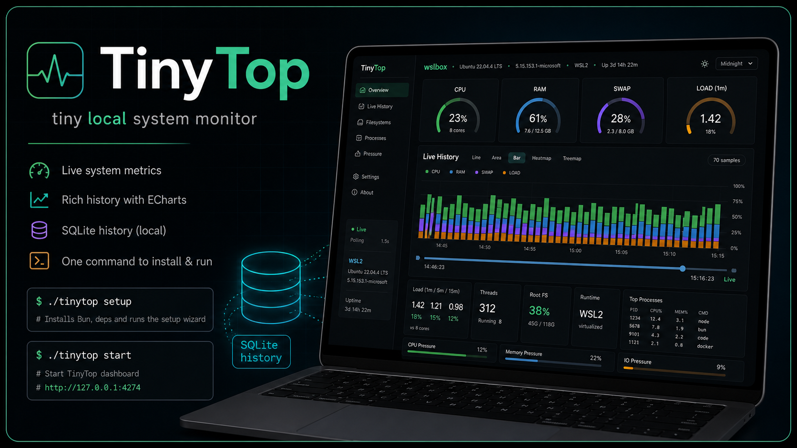
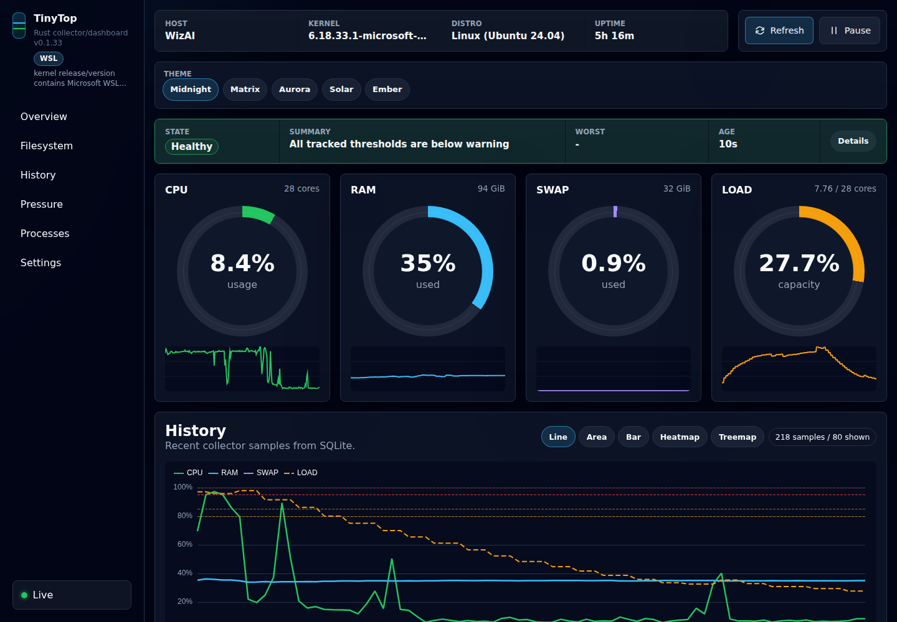

# TinyTop



A standalone local dashboard for live WSL/Linux workstation status. The default persistent runtime is a single Rust daemon that serves the dashboard, collects host telemetry, stores recent history in SQLite, and renders a dense browser UI with Apache ECharts.

## Current Status

- Version: `0.5.0`
- Runtime: Rust collector/dashboard daemon for persistent installs; Bun remains available for development and fallback
- Windows entrypoint: `.\tinytop.cmd` or process-scoped `Set-ExecutionPolicy -Scope Process -ExecutionPolicy Bypass` before `.\tinytop.ps1`
- Dashboard UI: Linux/WSL `http://127.0.0.1:4274`; native Windows defaults to `http://127.0.0.1:4275` to avoid loopback collisions with WSL
- Embeddable dashboard: `http://127.0.0.1:4274/embed?theme=dark` for iframe host panels, gated by `TINYTOP_EMBED_FRAME_ANCESTORS`
- Legacy collector API: `http://127.0.0.1:4276`
- Default SQLite database: Linux/WSL `~/.local/share/tinytop/history.sqlite`; Windows `%LOCALAPPDATA%\TinyTop\state\history.sqlite`
- SQLite retention: Rust daemon uses configurable L1 raw → L2 one-minute → L3 five-minute → L4 hourly horizons; L3/L4 are toggleable and L4 may be kept forever
- History API: raw snapshots remain available through `/api/history`; four-tier chart points, typed filesystem/process detail, coverage, and timeline markers have additive Rust endpoints
- Runtime identity: `./tinytop status` and `GET /api/version`
- Settings: browser-local display preferences plus SQLite-backed daemon defaults at `GET`/`PUT /api/settings`
- Dashboard assets: `agent/assets/dashboard/` is the single source served from disk by Bun and embedded by Rust, including the SVG favicon at `/favicon.svg`
- Network exposure: loopback only by default

## Screenshot




## Install And Run

```bash
git clone <repo-url> tinytop
cd tinytop
./tinytop rust install-binary
./tinytop systemd install --rust
./tinytop systemd start
```

Open <http://127.0.0.1:4274>.

For persistent installs without Bun, use the Rust collector/dashboard daemon:

```bash
./tinytop rust install-binary
./tinytop systemd install --rust
./tinytop systemd start
```

On Windows, use the native PowerShell command center:

```powershell
.\tinytop.cmd rust install-binary
# or: .\tinytop.cmd rust build
.\tinytop.cmd start
```

If you prefer calling the PowerShell script directly on a system where scripts are disabled, enable bypass only for the current shell first:

```powershell
Set-ExecutionPolicy -Scope Process -ExecutionPolicy Bypass
.\tinytop.ps1 rust install-binary
.\tinytop.ps1 start
```

Windows service install/start is explicit and guarded by an elevation check:

```powershell
.\tinytop.cmd service install
.\tinytop.cmd service start
```

If PowerShell is not elevated, interactive service mutations ask for confirmation before attempting the Windows Service Control Manager action; non-interactive non-elevated service mutations fail with Administrator guidance.

## On-Demand Release Binary Builds

TinyTop ships a manual GitHub Actions workflow for building release binaries without waiting for a push-triggered CI run:

```text
Actions -> Build release binaries -> Run workflow
```

Inputs:

- `platform`: `all`, `linux`, `windows`, or `macos`
- `release_tag`: existing tag to attach assets to when release upload is enabled
- `upload_to_release`: attach built binaries and checksums to `release_tag`

Artifacts produced:

- `tinytop-agent-linux-x86_64`
- `tinytop-agent-windows-x86_64.exe`
- `tinytop-agent-macos-x86_64`
- `tinytop-agent-macos-aarch64`

Each artifact includes a sibling `.sha256` checksum. See [docs/guides/RELEASE_BUILDS.md](docs/guides/RELEASE_BUILDS.md) for the operator flow.

Service install/uninstall require PowerShell running as Administrator. See [docs/guides/WINDOWS.md](docs/guides/WINDOWS.md).

If a release binary is not available for your platform, compile locally:

```bash
./tinytop install-rust --print-only
./tinytop rust build
./tinytop systemd install --rust
```

For local Rust builds, a C compiler is required (`build-essential` on Debian/Ubuntu, Xcode Command Line Tools on macOS, or the Visual Studio Build Tools C++ workload on Windows). `aws-lc-sys` tries its `cc` builder first when pregenerated bindings are available; CMake is used only for explicit CMake selection, FIPS/no-assembly/sanitizer builds, targets without pregenerated bindings, or after the `cc` builder fails, and is harmless to install. On Linux with `cc` absent, the real first `cc` 1.x failure line is `error occurred in cc-rs: failed to find tool "cc": No such file or directory (os error 2)`. See [INSTALL.md](INSTALL.md).

`./tinytop setup` is the Telecode-style Bun wizard for source/development installs. It asks whether to install the Rust collector/dashboard daemon or the legacy Bun collector path. For Rust installs, it also asks whether to use a GitHub release binary or a local Cargo compile. Verification inside the wizard is runtime-specific: Rust selections do not run Bun tests, and legacy Bun selections do not run Rust tests.

For full setup and configuration, see [INSTALL.md](INSTALL.md). For day-to-day usage, see [GUIDE.md](GUIDE.md).

## New User Guide

1. Clone the repo and enter it:

   ```bash
   git clone <repo-url> tinytop
   cd tinytop
   ```

2. Inspect the command center:

   ```bash
   ./tinytop help
   ./tinytop doctor
   ```

3. Install the Rust collector binary. Prefer a release binary:

   ```bash
   ./tinytop rust install-binary
   ```

   Or compile locally:

   ```bash
   ./tinytop install-rust --print-only
   ./tinytop rust build
   ```

4. Install persistent user-space systemd service:

   ```bash
   ./tinytop systemd install --rust
   ./tinytop systemd start
   ```

5. Open the dashboard:

   ```text
   http://127.0.0.1:4274
   ```

6. Install Bun only if you want the Bun setup wizard or TypeScript development:

   ```bash
   ./tinytop install-bun --print-only
   ./tinytop install-bun --yes
   ```

7. Optional source setup wizard:

   ```bash
   ./tinytop setup
   ```

8. Optional foreground runtime. The command center auto-selects the Rust collector/dashboard daemon when available and falls back to legacy Bun only when Rust is unavailable:

   ```bash
   ./tinytop start
   ```

   Force the legacy Bun dashboard when needed:

   ```bash
   TINYTOP_RUNTIME=legacy ./tinytop start
   ```

9. Useful maintenance commands:

   ```bash
   ./tinytop status
   ./tinytop logs
   ./tinytop db stats
   ./tinytop db backup
   ./tinytop db check
   ```

## Command Center

The root `./tinytop` command is the supported operator entrypoint:

```bash
./tinytop help
./tinytop doctor
./tinytop rust install-binary
./tinytop rust build
./tinytop install-bun --print-only
./tinytop setup
./tinytop start
./tinytop systemd install --rust
./tinytop db stats
./tinytop db backup
```

The Rust agent also exposes JSON-first database diagnostics and explicit
pre-image management:

| Command | Purpose |
| --- | --- |
| `tinytop-agent db stats --json` | Report the unchanged raw-sample stats plus all four ladder tiers, JSON-bearing sample count, archive and disk state (`freeBytes`, minimum, pressure, breach start, and last check), and OTel status including the headers environment-variable name and whether it is set (never its value) |
| `tinytop-agent db pre-image status` | Show the canonical `<database>.pre-v0.sqlite` path, existence/size, schema version, and main-database integrity result |
| `tinytop-agent db pre-image remove --yes` | Remove only that exact pre-image after confirmation when the main database exists, uses schema v1, and passes SQLite integrity check; otherwise refuse |
| `tinytop-agent config export [--out FILE]` | Export the daemon settings as a versioned, secret-free JSON document; stdout is the default. File publishing uses atomic no-clobber hard links when supported; otherwise it re-checks the destination and renames, leaving a few-microsecond window in which a file created by another process could be replaced. |
| `tinytop-agent config import FILE [--dry-run]` | Validate and preview an import, or apply it and record a settings marker; pruning is deferred to the daemon's next maintenance tick. |

Rust history is retained as an L1 raw → L2 one-minute → L3 five-minute → L4
hourly ladder. Completed buckets are folded from every finer row, frozen after
their grace window, promoted before finer data is pruned, and selected
automatically for long-range reads. See
[SQLite History Architecture](docs/sqlite-history-architecture.md) for the schema,
retention, migration, and read-path contract.

When `retentionLadder.archive.queryable` is enabled, hourly L4 buckets that pass
their configured horizon are verified in a separate `history-archive.sqlite`
before being removed from the main database, and remain available to
`source=archive` and long-range `source=auto` reads. The archive lives beside the
main database by default; an absolute `retentionLadder.archive.directory` moves
it to that directory. Coverage and point reads open it read-only and never
create a missing archive file.

For persistent background collection, install user-space systemd services:

```bash
./tinytop systemd install --rust
./tinytop systemd start
```

## What It Shows

- CPU utilization, CPU core count, and load averages
- RAM and swap usage
- Kernel, distro, uptime, and automatic WSL versus real Linux detection
- Filesystem capacity and inode pressure
- CPU, memory, and I/O pressure from `/proc/pressure/*` when available
- Top processes by CPU and memory
- Live CPU, RAM, swap, and load gauges with sparklines, status strips, and stat tiles
- Apache ECharts History views: line, stacked area, stacked bar, heatmap, and treemap
- Responsive Bar mode that keeps a minimum bar width and rolls the visible window left as new samples arrive
- SQLite-backed recent history so browser refreshes refill History instead of starting empty
- Timestamp-based timeline with Live, 15m, 1h, 6h, 24h, 7d, 30d, 90d, 1y, and All range presets
- Tier-selected 6h-through-All timeline browsing with daemon-start, settings-change, migration, coverage-gap, `diskPressure`, and `diskRecovered` markers
- Timeline rail with overview trace, selected datetime context, compact metric values, history coverage, DB budget status, and a return-to-now control
- Operator status strip with Healthy, Warning, Critical, and Stale states from saved thresholds plus a detail drawer explaining metric values, thresholds, age, trend, and recent changes
- Critical, Warning, and Stale operator states use stronger full-strip visual treatment and text labels so the state is obvious at a glance
- Process search, sort, density controls, and process detail drawer with redacted copy-safe command text, parent PID/start time when available, RSS, and per-PID CPU/RAM trend
- Filesystem root card, system-mount toggle, and threshold-colored filesystem bars
- Visible collector/dashboard runtime and version metadata in the sidebar
- In-app confirmation dialogs for browser-local destructive actions, including clearing the session history buffer
- Browser-local display preferences for theme, graph mode, selected history range, visible series, process table controls, filesystem toggle, and last section
- Settings dialog with separate `This Browser` local preferences and `This Daemon` SQLite-backed defaults, including threshold presets, validation, reset/default actions, unsaved-change guard, effective settings readout, target DB budget, thresholds, and compact toggle controls for enabled dashboard sections
- Rust Linux/WSL daemon under `agent/` with shared snapshot types, crate-backed collection, SQLx SQLite history, a no-Bun systemd path, and feature-gated native macOS/Windows collector modules started behind opt-in build features
- Native Windows command center for the Rust daemon, including foreground lifecycle, Windows service commands, process-scoped execution-policy guidance, and a `.\tinytop.cmd` wrapper
- Runtime-origin notice when a browser is connected to the Windows daemon instead of the WSL/Linux daemon, or vice versa

## Common Commands

```bash
./tinytop setup
./tinytop rust install-binary
./tinytop rust build
./tinytop rust serve
./tinytop systemd render
powershell.exe -ExecutionPolicy Bypass -File ./tinytop.ps1 help
powershell.exe -ExecutionPolicy Bypass -File ./tinytop.ps1 rust build
powershell.exe -ExecutionPolicy Bypass -File ./tinytop.ps1 service status
./tinytop start
./tinytop start:split
./tinytop db stats
bun run dev
bun run collector
bun test
bun run check:bun
bun run check:rust
bun run check
bun run rust:test
bun run rust:serve
bun build agent/assets/dashboard/app.js --target=browser --outdir=/tmp/tinytop-build-check
```

## Rust Collector/Dashboard Daemon

The Rust workspace lives under `agent/` and provides the default persistent runtime:

```bash
cargo test --manifest-path agent/Cargo.toml --workspace
cargo run --manifest-path agent/Cargo.toml -p tinytop-agent -- collect --json
cargo run --manifest-path agent/Cargo.toml -p tinytop-agent -- serve
```

The Rust daemon is the collector and dashboard in one process on `127.0.0.1:4274`. The older Bun dashboard/collector split is still available with `TINYTOP_RUNTIME=legacy ./tinytop start`, `./tinytop start:split`, and `./tinytop systemd install --bun`.

Use these checks to confirm which runtime is serving the dashboard:

```bash
./tinytop status
curl -fsS http://127.0.0.1:4274/api/version
```

Implementation notes:

- The Rust Linux collector uses `procfs` and `sysinfo`; it does not shell out to `df`, `ps`, or `uname`.
- The live collector keeps a reusable `sysinfo::System` so repeated samples avoid rebuilding all collector state from scratch.
- Linux is the default supported collector feature. Native macOS and Windows collectors are present as opt-in Rust feature-gated modules for identity, CPU, memory, load equivalent, disks, and processes; Linux remains the reference implementation until those hosts receive full live-machine verification.
- Local Rust builds require Rust `1.95.0` or newer because the pinned `sysinfo` release uses that MSRV.

## Documentation Map

| File | Purpose |
| --- | --- |
| [HANDOFF.md](HANDOFF.md) | Current restart point, daemon state, verification evidence, and next work |
| [INSTALL.md](INSTALL.md) | Prerequisites, setup, environment variables, running, upgrade, uninstall |
| [GUIDE.md](GUIDE.md) | User guide for the dashboard UI, graph modes, timeline, refresh behavior |
| [ARCHITECTURE.md](ARCHITECTURE.md) | Process model, data flow, modules, SQLite schema, safety boundaries |
| [CHANGELOG.md](CHANGELOG.md) | Versioned release notes |
| [PROGRESS.md](PROGRESS.md) | Completed milestones and next work |
| [docs/guides/API.md](docs/guides/API.md) | Public dashboard API and internal collector API |
| [docs/INTEGRATION.md](docs/INTEGRATION.md) | Stable TinyTop integration contract for host dashboards and iframe embeds |
| [docs/guides/OPERATIONS.md](docs/guides/OPERATIONS.md) | Runtime checks, SQLite inspection, backup/reset, troubleshooting |
| [docs/guides/WINDOWS.md](docs/guides/WINDOWS.md) | Native Windows PowerShell command center, service commands, and packaging roadmap |
| [docs/guides/RELEASE_BUILDS.md](docs/guides/RELEASE_BUILDS.md) | Manual GitHub Actions workflow for Linux, Windows, and macOS release binaries |
| [docs/sqlite-history-architecture.md](docs/sqlite-history-architecture.md) | Persistence design and current SQLite implementation |
| [docs/reports/2026-06-24-rust-agent-dependency-vetting.md](docs/reports/2026-06-24-rust-agent-dependency-vetting.md) | Rust collector dependency and SQLx vetting |
| [docs/reports/2026-06-25-rust-daemon-dependency-vetting.md](docs/reports/2026-06-25-rust-daemon-dependency-vetting.md) | Rust daemon and vendored dashboard asset dependency vetting |
| [docs/reports/2026-06-25-webui-confirmation-dialog-verification.md](docs/reports/2026-06-25-webui-confirmation-dialog-verification.md) | Web UI confirmation-dialog policy and rendered verification |
| [docs/reports/2026-06-25-documentation-sweep.md](docs/reports/2026-06-25-documentation-sweep.md) | Documentation sweep for the embedded Rust collector/dashboard asset move |
| [docs/reports/2026-06-26-history-retention-docs.md](docs/reports/2026-06-26-history-retention-docs.md) | Documentation sweep clarifying current SQLite retention and UI history-window behavior |
| [docs/reports/2026-06-26-runtime-specific-verification.md](docs/reports/2026-06-26-runtime-specific-verification.md) | Verification split for Rust versus legacy Bun setup choices |
| [docs/reports/2026-06-26-dashboard-timeline-settings.md](docs/reports/2026-06-26-dashboard-timeline-settings.md) | Timestamp timeline implementation, settings implementation, and smoke test evidence |
| [docs/reports/2026-06-26-runtime-auto-detect-version.md](docs/reports/2026-06-26-runtime-auto-detect-version.md) | Runtime auto-detection and API/sidebar version identity |
| [docs/reports/2026-06-26-settings-dialog.md](docs/reports/2026-06-26-settings-dialog.md) | Settings dialog presentation change and focused UI verification |
| [docs/reports/2026-06-26-load-gauge.md](docs/reports/2026-06-26-load-gauge.md) | Load overview gauge implementation and verification |
| [docs/reports/2026-06-26-dashboard-operator-console.md](docs/reports/2026-06-26-dashboard-operator-console.md) | Operator console dashboard slice, retention enforcement, rollups, and verification |
| [docs/reports/2026-06-26-select-dropdown-contrast.md](docs/reports/2026-06-26-select-dropdown-contrast.md) | Native dropdown contrast fix and embedded dashboard verification |
| [docs/reports/2026-06-26-windows-command-center-and-critical-status.md](docs/reports/2026-06-26-windows-command-center-and-critical-status.md) | Windows PowerShell command center, service path, and Critical strip visibility |
| [docs/reports/2026-06-27-settings-toggles-release.md](docs/reports/2026-06-27-settings-toggles-release.md) | Settings toggle layout fix, screenshot refresh, and v0.1.31 release verification |
| [docs/reports/2026-06-27-live-readme-screenshot.md](docs/reports/2026-06-27-live-readme-screenshot.md) | Live connected README screenshot refresh and v0.1.32 checkpoint verification |
| [docs/reports/2026-06-27-windows-service-elevation-guard.md](docs/reports/2026-06-27-windows-service-elevation-guard.md) | Windows service elevation confirmation guard and v0.1.33 checkpoint verification |
| [docs/reports/2026-06-27-on-demand-binary-workflow.md](docs/reports/2026-06-27-on-demand-binary-workflow.md) | On-demand Linux, Windows, and macOS binary workflow and v0.1.34 verification |
| [docs/reports/2026-06-29-windows-native-runtime-fixes.md](docs/reports/2026-06-29-windows-native-runtime-fixes.md) | Windows execution-policy, service dispatch, default port, SQLite path, and runtime-origin metadata fixes |
| [docs/reports/2026-06-30-nginx-subpath-integration.md](docs/reports/2026-06-30-nginx-subpath-integration.md) | Nginx reverse-proxy subpath integration notes for the embedded Rust dashboard |
| [docs/superpowers/plans/2026-06-26-dashboard-timeline-settings.md](docs/superpowers/plans/2026-06-26-dashboard-timeline-settings.md) | Plan for timeline repair, SQLite daemon settings, settings UI, retention, and rollups |
| [docs/superpowers/plans/2026-06-26-dashboard-operator-console.md](docs/superpowers/plans/2026-06-26-dashboard-operator-console.md) | Executed plan for operator status, Timeline V2, settings application, process/filesystem controls, and history backend follow-through |
| [docs/superpowers/plans/2026-06-26-windows-command-center-and-critical-status.md](docs/superpowers/plans/2026-06-26-windows-command-center-and-critical-status.md) | Executed plan for Windows command-center support and Critical status visibility |
| [docs/superpowers/specs/2026-06-24-tinytop-install-wizard-design.md](docs/superpowers/specs/2026-06-24-tinytop-install-wizard-design.md) | Install wizard and systemd command-center design record |
| [docs/adr/README.md](docs/adr/README.md) | Architecture decision records |

## License

TinyTop is licensed under the Apache License, Version 2.0. See [LICENSE](LICENSE) and [NOTICE](NOTICE).

## Configuration Summary

| Variable | Default | Meaning |
| --- | --- | --- |
| `HOST` | `127.0.0.1` | Dashboard bind host |
| `PORT` | `4274` on Linux/WSL, `4275` on native Windows | Dashboard port |
| `HISTORY_WRITER_HOST` | `127.0.0.1` | Legacy collector bind host; env name retained for compatibility |
| `HISTORY_WRITER_PORT` | `4276` | Legacy collector port; env name retained for compatibility |
| `HISTORY_WRITER_URL` | unset | Existing collector URL; when set, dashboard does not spawn a collector |
| `HISTORY_POLL_MS` | `1500` | Collector sampling interval |
| `TINYTOP_RUNTIME` | `auto` | Runtime selection for `./tinytop start`: `auto`, `rust`, `legacy`, or `bun` |
| `TINYTOP_HISTORY_DB` | Linux/WSL `~/.local/share/tinytop/history.sqlite`; Windows `%LOCALAPPDATA%\TinyTop\state\history.sqlite` | SQLite database path |
| `TINYTOP_SYSTEMD_UNIT_DIR` | `~/.config/systemd/user` | Bash command-center systemd user-unit directory override |
| `TINYTOP_DISABLE_WRITER_SPAWN` | unset | Set to `1` when starting the legacy Bun collector separately |
| `TINYTOP_PUBLIC_DIR` | unset | Optional development override for Rust dashboard assets; unset uses embedded assets |
| `TINYTOP_EMBED_FRAME_ANCESTORS` | `'self'` | CSP `frame-ancestors` value for `/embed` only, for example `'self' http://127.0.0.1:9323` |

## Ports

The project claims these loopback ports in `~/.config/fleet/ports/tinytop.toml`:

- `127.0.0.1:4274` - Linux/WSL dashboard UI
- `127.0.0.1:4275` - native Windows dashboard UI
- `127.0.0.1:4276` - legacy/internal collector API for split mode

## Persistence

Recent history is stored in SQLite by the Rust daemon in the default runtime. In legacy Bun split mode, the collector process owns SQLite and the dashboard process reads through the collector API.

In the Rust daemon, `retentionLadder` in `/api/settings` controls every ladder horizon, the recent snapshot-JSON window, and typed filesystem/process sampling cadence. `retentionHours` and `rollupRetentionDays` remain in every saved document as derived compatibility mirrors for the Bun runtime, so a typed save that edits only those mirrors is overwritten from authoritative L1/L2. Legacy Bun split mode keeps the older manual archive/reset behavior.

| Setting | Default | Validation / meaning |
| --- | ---: | --- |
| `retentionLadder.l1.keepDays` | `3` | Raw typed samples; 3–3,650 days; always enabled |
| `retentionLadder.l2.keepDays` | `30` | One-minute rollups and typed detail retention; 7–3,650 days; always enabled |
| `retentionLadder.l3` | enabled, `90` days | Five-minute rollups; when enabled, retention must be at least L2 and at most 3,650 days |
| `retentionLadder.l4` | enabled, `730` days | Hourly rollups; `0` means forever, otherwise retention must be at least the nearest enabled finer tier and at most 36,500 days |
| `retentionLadder.snapshotJsonKeepMinutes` | `60` | Complete raw snapshot JSON; 60–1,440 minutes |
| `retentionLadder.detailIntervalSec` | `60` | Filesystem/process typed-sample cadence; 15–3,600 seconds |
| `retentionLadder.archive` | off | `queryable` moves expired L4 rows into `history-archive.sqlite`; `directory` is empty (beside the main DB) or absolute. `cold` requires `queryable` and exports complete eligible UTC months as verified `csv.gz` files plus `sha256sum`-compatible sidecars after 1–120 months. |
| `retentionLadder.diskCheck` | `intervalMinutes: 60`, `minFreeBytes: 5 GiB` | Interval 5–1,440 minutes; minimum at least 256 MiB. A breach shows a banner and refuses retention growth or tier/archive enables; it never deletes history. |

Daemon dashboard defaults are stored in SQLite in `app_settings` through `GET /api/settings` and `PUT /api/settings`. A legacy document without `retentionLadder` is derived in memory from `retentionHours` and `rollupRetentionDays` and is not rewritten until an explicit save. While persisted `history_state.diskPressure.active` is true, the server refuses horizon growth or enabling a tier/archive, but still permits shrinking. Active theme, graph mode, history range, visible series, process table preferences, filesystem system-mount toggle, and last section stay in this browser's `localStorage`.

Settings export is a versioned JSON document that contains daemon settings but no secrets: credential-bearing values are not settings, and integrations refer only to environment-variable names. Import uses the same decoder and validation as the settings dialog, including refusal of retention growth under disk pressure. A CLI import deliberately does not prune from a second process; a running daemon re-reads the saved settings and performs maintenance on its next collection tick.

## OpenTelemetry export

The Rust daemon can push the latest collected snapshot as OTLP metrics over HTTP/protobuf. It is disabled by default and never reads from OpenTelemetry. Configure it in the Settings dialog, or include the `otel` block in a `config import` document. Request headers are secret-free by design: set `TINYTOP_OTEL_HEADERS="authorization=Bearer <token>"` in the daemon's service environment, using an environment variable named by `headersEnvVar`; the value is never stored in settings or an export. The exporter refuses to start while either `OTEL_EXPORTER_OTLP_HEADERS` or `OTEL_EXPORTER_OTLP_METRICS_HEADERS` is set, so TinyTop has one parser and one header source; neither reserved name may be selected as `headersEnvVar`.

For a user systemd service, create `~/.config/systemd/user/tinytop.service.d/otel.conf` with these three lines:

```ini
[Service]
# Header values belong in the service environment, not TinyTop settings.
Environment="TINYTOP_OTEL_HEADERS=authorization=Bearer <token>"
```

Then run `systemctl --user daemon-reload` and restart TinyTop. A minimal local `otelcol-contrib` receiver is:

```yaml
receivers:
  otlp:
    protocols:
      http:
        endpoint: 127.0.0.1:4318
exporters:
  debug:
service:
  pipelines:
    metrics:
      receivers: [otlp]
      exporters: [debug]
```

All exported instruments are gauges:

| Metric | Unit | Attributes |
| --- | --- | --- |
| `system.cpu.utilization` | `1` | — |
| `system.memory.utilization` | `1` | — |
| `system.memory.usage` | `By` | `state=used` |
| `system.memory.limit` | `By` | — |
| `system.paging.utilization` | `1` | `state=used` |
| `system.cpu.load_average.1m` | `{thread}` | — |
| `system.cpu.load_average.5m` | `{thread}` | — |
| `system.cpu.load_average.15m` | `{thread}` | — |
| `system.filesystem.utilization` | `1` | `mountpoint`, `type` |
| `system.filesystem.usage` | `By` | `mountpoint`, `type`, `state=used\|free` |
| `tinytop.load.percent` | `%` | — |
| `tinytop.pressure.some` | `%` | `resource=cpu\|memory\|io`; emitted only when reported |
| `tinytop.pressure.full` | `%` | `resource=cpu\|memory\|io`; emitted only when reported |

Resource attributes include `service.name`, `service.version` (the agent version), `host.name`, and configured `resourceAttributes`. Export runs in its own daemon task at the configured interval. Settings changes are picked up on the exporter's next 5-second tick; an export already in flight (bounded by its 10-second timeout) can delay that tick, so a change is applied within 10 seconds at worst and within 5 seconds when the receiver answers promptly. The header variable is read whenever the exporter pipeline is built: toggle export off and on or change the `otel` settings block to apply a rotated value; restarting the daemon also re-reads it. Changing only the environment of an already-running, unchanged pipeline does not. Failed exports increment `otel.failures` in `/api/history/coverage` and log at most one warning per minute; collection and persistence continue unaffected. The Bun runtime has no OTel exporter.

### History API

| Endpoint | Rust response |
| --- | --- |
| `GET /api/history` | Complete raw snapshots whose `snapshot_json` is still retained; `limit` is clamped to 1–10,000. |
| `GET /api/history/points` | Chart points from `auto`, `raw`, `rollup` (1 minute), `5m`, `1h`, or `archive`, plus top-level `source`, `resolutionMs`, and `available`. `archive` returns hourly points with `available:true` when `retentionLadder.archive.queryable` is enabled; an explicit archive request while it is disabled is an empty `available:false` page. |
| `GET /api/history/coverage` | Existing database/raw/rollup fields plus every ladder tier, JSON horizon, detail cadence, disk state (`freeBytes`, `minFreeBytes`, `pressure`, `pressureSinceMs`, `lastCheckMs`), archive state, migration state, and Rust-daemon OTel status (`enabled`, `endpoint`, `intervalSec`, `lastSuccessMs`, `lastFailureMs`, `lastError`, `failures`). |
| `GET /api/history/filesystems` | Typed filesystem samples; accepts `sinceMs`, `untilMs`, exact `mount`, and a 1–10,000 clamped `limit`. |
| `GET /api/history/processes` | Typed process samples grouped into complete `capturedAtMs` captures; accepts `sinceMs`, `untilMs`, and a 1–10,000 clamped capture limit. |
| `GET /api/history/markers` | Persisted daemon/settings/migration/disk-pressure/disk-recovery events and computed coverage gaps. |
| `GET /api/settings/export` | Pretty-printed version-1 settings envelope with an attachment filename and `no-store`; Rust daemon only. |
| `POST /api/settings/import` | Validate and apply a settings envelope, run daemon maintenance, and record an import marker. `?dryRun=true` returns validation errors, warnings, changed keys, and exact candidate-horizon `wouldDelete` counts without writing; Rust daemon only. |

The range parameters also retain their existing snake_case aliases for compatibility. For `source=auto`, the daemon uses the configured poll interval for L1 and fixed 1-minute/5-minute/1-hour resolutions for L2/L3/L4. It chooses the finest enabled tier that still holds the requested start and whose whole range fits the page limit. If none fits the limit, it returns the coarsest tier that holds the start; if no tier holds it, it selects the queryable archive when enabled or the coarsest enabled tier otherwise.

The dashboard does not render the whole database. On page load it requests the browser-selected timestamp window, defaulting to Live. Live, 15m, and 1h use paged raw snapshots. Every preset from 6h through All sends one `/api/history/points?source=auto&limit=10000` request so the Rust daemon chooses the finest enabled tier that holds the range start without exceeding 10,000 buckets. At the default ladder this yields 6h → 1 minute (360 points), 24h → 1 minute (1,440), 7d → 5 minutes (2,016), 30d → 5 minutes (8,640), 90d → 1 hour (2,160), and 1y → 1 hour (8,760). All uses the coarsest tier holding the oldest retained data; the newest 10,000 hourly buckets cover about 416 days, and the queryable archive holds the rest. A long preset is disabled only when no enabled tier holds its start and the archive is not queryable; if the selected preset becomes unavailable, the browser falls back to the nearest finer preset without changing the saved preference. The Bun runtime keeps raw presets through 1h, disables longer presets with a Rust-daemon tooltip, and does not expose the Rust-only ladder form. Browser rendering may downsample loaded points when needed. These query windows do not delete older SQLite rows.

The current Rust SQLite implementation stores indexed metric columns with recent complete snapshot JSON, maintains the four-tier ladder, records typed filesystem/process detail and daemon timeline events, and exposes the additive history endpoints above.

## Verification

```bash
./tinytop check
bun run check:bun
bun run check:rust
./tinytop help
./tinytop doctor
git diff --check
```

## Safety

The dashboard is read-only with respect to the operating system. The Rust collector uses `procfs` and `sysinfo` instead of shelling out to `df`, `ps`, or `uname`. SQLite writes are limited to the configured dashboard history database.
